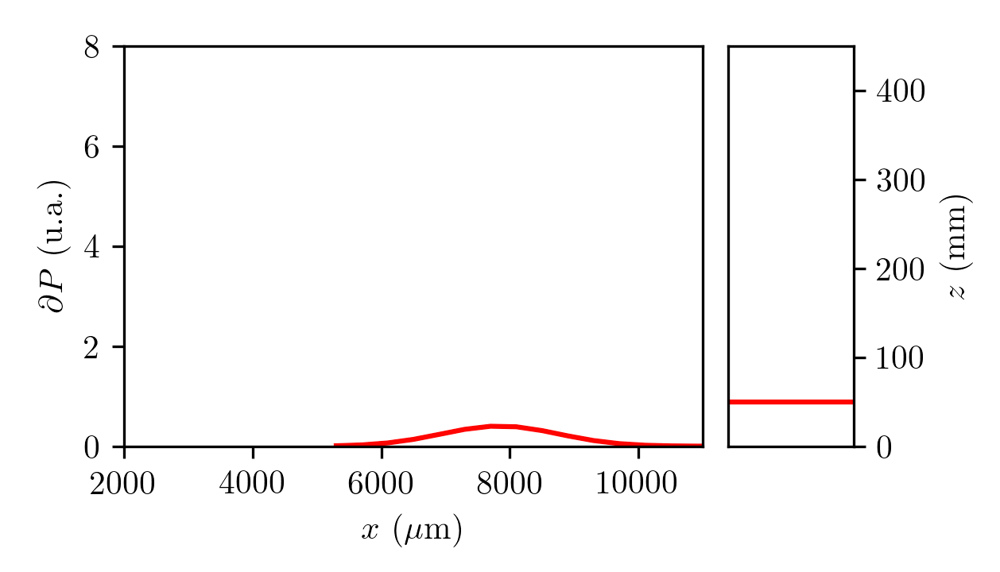

# LAser Beam PROfiling

This repository contains three .py files written in python to analyse data from a laboratory activity on measuring the waist, divergence and M-squared of an infrared ultrashort pulse laser using the knife-edge method.
More info about the method can be found [here](http://people.fjfi.cvut.cz/blazejos/public/ul7en.pdf). 

## What do the codes do?

All of the codes initially load all Data#.txt files in the directory (values of power vs position and their uncertanties) and fit (least square) them using a complementary error function, according to the knife-edge method.
Then:
- M-squared.py plots w vs z, fits the plot, calculates waist, divergence and M-squared for both the real and theoretical beam and save the results;
- Beam Profile (2D).py  calculates the first derivatives of the fit functions, plots them one at the time next to an indicator of the value of z and combine these plots into a gif;
- Beam Profile (3D).py  calculates the first derivatives of the fit functions, plots them all together in a  3D frame, saves 360 copies of it (rotating the frame of 1 deg each time) and combine all the plots into a gif.

## Output

The output gifs of Beam Profile (2D).py and Beam Profile (3D).py obtained by the Author are shown below:

## About

The code was written by Filippo M. Conte in May 2019 for a laboratory activity conducted within the “Introduction to Laser Physics” course of Prof. A. Ancona,  University of Bari.

## License

The code is published under [MIT license](https://choosealicense.com/licenses/mit/). 
